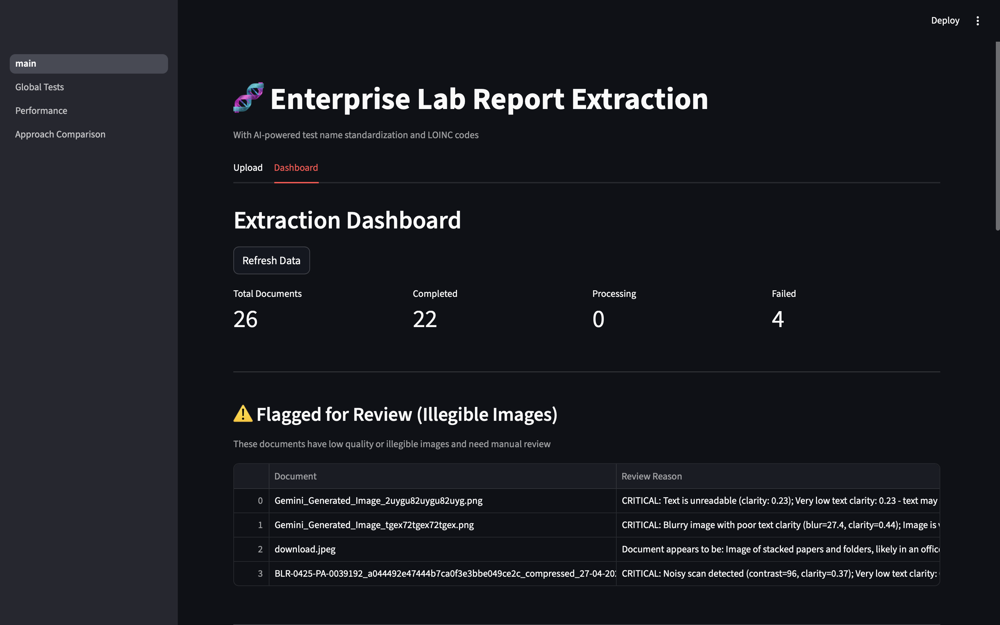
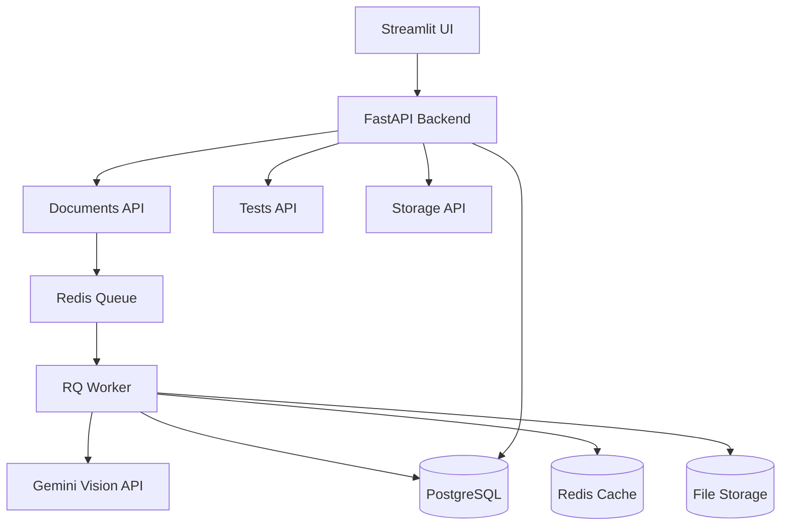
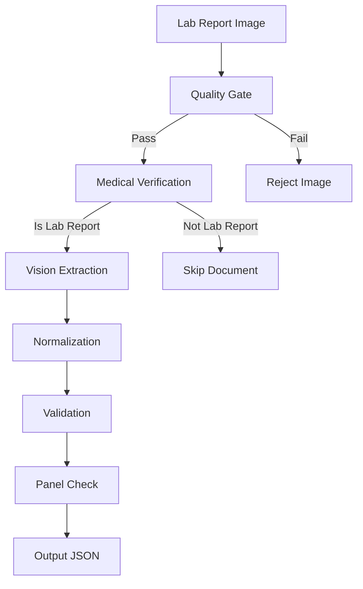
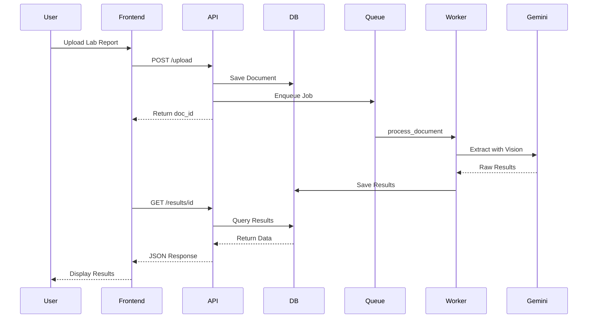
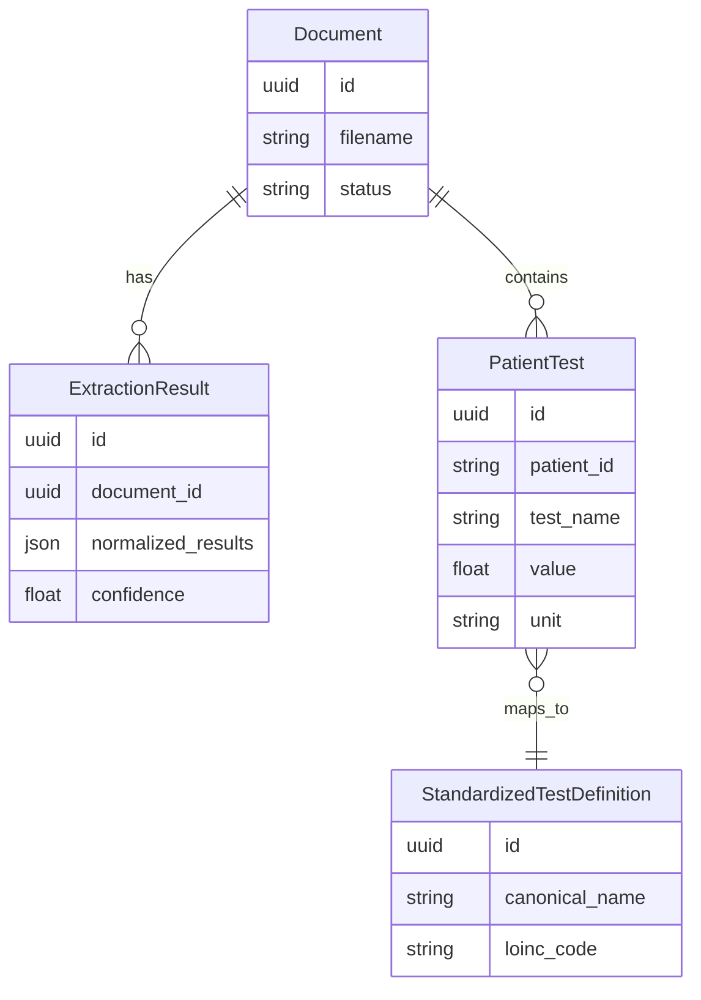

# 🧬 Enterprise Lab Report Extraction System

[](https://www.python.org/downloads/)
[](https://fastapi.tiangolo.com/)
[](https://www.docker.com/)
[](https://opensource.org/licenses/MIT)

> **AI-powered medical lab report extraction using Google Gemini Vision API.**  
> Upload lab reports → Extract structured data → Standardize test names → Export for analysis.

---

## ✨ Key Features

| Feature | Description |
|---------|-------------|
| 🔬 **Vision Extraction** | Extract lab values from scanned reports using Gemini Vision |
| 📊 **Test Standardization** | Map 100+ test names to LOINC codes with fuzzy matching |
| 🔍 **Quality Gate** | Reject blurry, noisy, or unreadable images before processing |
| 🏥 **Medical Verification** | Verify document is a medical report before extraction |
| 🔁 **Duplicate Detection** | Detect and skip already-uploaded files using perceptual hashing |
| ⚡ **Redis Caching** | Two-tier caching reduces redundant API calls |
| 📈 **Batch Processing** | Upload multiple files with progress tracking |

### 📚 Documentation

| Document | Description |
|----------|-------------|
| [Configuration Guide](docs/CONFIGURATION.md) | All settings, thresholds, and tuning options |
| [Image Processing](docs/IMAGE_PROCESSING.md) | Quality checks, preprocessing algorithms, pipelines |
| [System Architecture](docs/CALL_TREE.md) | Call tree, request flows, file-by-file guide |
| [Unused Features](docs/UNUSED_FEATURES.md) | Features coded but not wired up |



---

## 🚀 Quick Start

### Prerequisites

- **Python 3.11+** or **Docker**
- **Redis** (for job queue and caching)
- **PostgreSQL** (for data storage)
- **Gemini API Key** from [Google AI Studio](https://aistudio.google.com/apikey)

### Option 1: Local Development (Recommended)

```bash
# 1. Clone and configure
git clone <repository-url>
cd lab_extraction_system
cp .env.example .env

# 2. Add your Gemini API key to .env
# GEMINI__API_KEY=your_key_here

# 3. Start Redis and PostgreSQL
brew services start redis      # macOS
brew services start postgresql # macOS

# 4. Run the application
chmod +x start.sh
./start.sh
```

### Option 2: Docker Compose

```bash
# 1. Configure environment
cp .env.example .env
# Edit .env and add GEMINI__API_KEY

# 2. Start all services
docker-compose up --build

# 3. Access the application
# Frontend: http://localhost:8501
# API Docs: http://localhost:6000/docs
```

---

## 🖥️ Access Points

| Service | URL | Description |
|---------|-----|-------------|
| **Frontend** | http://localhost:8501 | Streamlit Dashboard |
| **API Docs** | http://localhost:6000/docs | Swagger UI |
| **ReDoc** | http://localhost:6000/redoc | Alternative API docs |

---

## 📋 How It Works

### System Architecture



### Extraction Pipeline



**Pipeline Steps:**
1. **Quality Gate** - Check blur, contrast, noise
2. **Medical Verification** - Confirm it is a lab report
3. **Vision Extraction** - Gemini API extracts patient info and tests
4. **Normalization** - YAML lookup, Levenshtein matching, LLM fallback
5. **Validation** - LLM verification, value range checks
6. **Panel Check** - Verify completeness, flag missing tests
7. **Output** - Structured JSON and clinical summary

### Complete Request Flow



### Data Models



### Quality Gate Criteria

Images are **rejected** if they fail these checks:

| Check | Threshold | Description |
|-------|-----------|-------------|
| Blur Score | < 50 | Image too blurry to read |
| High Contrast + Low Clarity | contrast>85 & clarity<0.45 | Noisy scan detected |
| Text Clarity | < 0.25 | Text completely unreadable |

---

## 📁 Project Structure

```
lab_extraction_system/
├── backend/                    # FastAPI Backend
│   ├── api/                    # API routes (documents, tests, storage)
│   ├── core/                   # Config, database, queue
│   ├── models/                 # SQLModel database models
│   └── utils/                  # Image optimizer, helpers
│
├── workers/                    # Background Processing
│   └── extraction/             # Extraction pipeline
│       ├── main.py             # Document processor entry
│       ├── single_vision_extractor.py  # Core Gemini extraction
│       ├── strict_normalizer.py # Test name standardization
│       ├── ocr_quality.py      # Image quality gate
│       ├── panel_validator.py  # Panel completeness check
│       ├── cache_manager.py    # Redis + disk caching
│       └── rate_limiter.py     # Adaptive rate limiting
│
├── frontend_app/               # Streamlit Frontend
│   ├── main.py                 # Main dashboard
│   └── pages/                  # Multi-page navigation
│
├── config/                     # Configuration
│   ├── settings.yaml           # App settings
│   └── test_mappings.yaml      # Test → LOINC mappings
│
├── storage/                    # File storage
│   └── lab-reports/            # Uploaded images
│
├── docker-compose.yaml         # Docker orchestration
├── start.sh                    # Local dev startup script
├── requirements.txt            # Python dependencies
└── .env.example                # Environment template
```

---

## ⚙️ Configuration

### Required Environment Variables

```bash
# .env file
GEMINI__API_KEY=your_gemini_api_key_here    # Required!
GEMINI__MODEL=gemma-3-27b-it                # or gemini-2.5-flash
```

### Optional Settings

| Variable | Default | Description |
|----------|---------|-------------|
| `DATABASE__URL` | PostgreSQL | Database connection string |
| `REDIS__URL` | `redis://localhost:6379/0` | Redis connection |
| `GEMINI__RATE_LIMIT` | `15` | Requests per minute |
| `PROCESSING__ENABLE_CACHING` | `true` | Enable result caching |
| `PROCESSING__CACHE_TTL_HOURS` | `24` | Cache duration |
| `STANDARDIZATION__FUZZY_THRESHOLD` | `0.85` | Match threshold |

---

## 📡 API Reference

### Upload Documents

```bash
# Single file
curl -X POST "http://localhost:6000/api/v1/upload" \
  -F "files=@lab_report.jpg"

# Multiple files
curl -X POST "http://localhost:6000/api/v1/upload" \
  -F "files=@report1.jpg" \
  -F "files=@report2.jpg"
```

**Response:**
```json
{
  "total_uploaded": 2,
  "new_files_count": 1,
  "duplicates_count": 1,
  "message": "Queued 1 new file(s). 1 file(s) were duplicates (already uploaded).",
  "duplicates": [
    {
      "uploaded_filename": "report2.jpg",
      "existing_filename": "report2.jpg",
      "message": "'report2.jpg' is a duplicate (uploaded previously)"
    }
  ]
}
```

### Get Documents

```bash
curl "http://localhost:6000/api/v1/documents"
```

### Get Extraction Results

```bash
curl "http://localhost:6000/api/v1/results/{document_id}"
```

**Response:**
```json
{
  "lab_results": [
    {
      "test_name": "Hemoglobin",
      "original_name": "Hb",
      "value": "14.5",
      "unit": "g/dL",
      "reference_range": "12.0-16.0",
      "flag": "Normal",
      "loinc_code": "718-7"
    }
  ],
  "patient_info": {
    "name": "John Doe",
    "patient_id": "12345",
    "age": "45",
    "gender": "M"
  },
  "confidence_score": 0.92
}
```

### Other Endpoints

| Method | Endpoint | Description |
|--------|----------|-------------|
| `GET` | `/documents` | List all documents |
| `GET` | `/documents/flagged` | Documents needing review |
| `GET` | `/tasks/{task_id}` | Check processing status |
| `GET` | `/storage/stats` | Storage statistics |
| `GET` | `/storage/cache-stats` | Cache hit/miss stats |
| `GET` | `/tests/all` | All extracted tests |
| `GET` | `/tests/stats` | Test statistics |

---

## 🧪 Testing

The project includes a comprehensive test suite with **80+ tests** covering unit, integration, and E2E testing.

### Test Structure

```
tests/
├── conftest.py              # Shared fixtures (mocked Redis, Gemini, images)
├── unit/                    # 80 unit tests
│   ├── test_rate_limiter.py    # Rate limiting (14 tests)
│   ├── test_cache_manager.py   # Caching (12 tests)
│   ├── test_preprocessing.py   # Image preprocessing (11 tests)
│   ├── test_ocr_quality.py     # Quality gate (20 tests)
│   └── test_strict_normalizer.py # Normalization (23 tests)
├── integration/             # API endpoint tests
│   └── test_api_endpoints.py
├── e2e/                     # End-to-end pipeline tests
│   └── test_extraction_pipeline.py
└── fixtures/
    └── sample_lab_reports.py # Sample test data
```

### Running Tests

```bash
# Activate virtual environment
source venv/bin/activate

# Run all unit tests
pytest tests/unit/ -v

# Run specific test file
pytest tests/unit/test_rate_limiter.py -v

# Run with coverage
pytest tests/unit/ --cov=backend --cov=workers --cov-report=term-missing

# Run all tests (requires services running)
pytest tests/ -v
```

### Test Markers

```bash
# Run only unit tests
pytest -m unit

# Run only integration tests
pytest -m integration

# Run only E2E tests
pytest -m e2e
```

---

## 🐳 Docker Deployment

### Development

```bash
docker-compose up --build
```

### Production (Multiple Workers)

```bash
docker-compose up --build -d
docker-compose up --scale worker=3 -d  # Scale workers
```

### View Logs

```bash
docker-compose logs -f backend
docker-compose logs -f worker
```

### Clear Database

```bash
docker exec lab_extraction_postgres psql -U postgres -d lab_extraction \
  -c "TRUNCATE patient_tests, extraction_results, documents CASCADE;"
```

---

## 🔧 Troubleshooting

### Common Issues

| Issue | Solution |
|-------|----------|
| "Connection refused" | Ensure Redis and PostgreSQL are running |
| "Rate limit exceeded" | Reduce `GEMINI__RATE_LIMIT` in .env |
| "Image quality too poor" | Upload clearer image (>50 blur score) |
| "Not a medical report" | System rejected non-lab document |

### Check Service Health

```bash
# Local
curl http://localhost:6000/docs  # Backend
redis-cli ping                    # Redis
pg_isready -h localhost           # PostgreSQL

# Docker
docker-compose ps
docker-compose logs backend
```

---

## 📊 Performance Tips

1. **Enable Caching**: Set `PROCESSING__ENABLE_CACHING=true`
2. **Scale Workers**: Use `docker-compose up --scale worker=3`
3. **Batch Uploads**: Upload multiple files at once
4. **Image Quality**: Upload clear, high-resolution scans
5. **Rate Limiting**: Adjust `GEMINI__RATE_LIMIT` based on your API quota

---

## 🤝 Contributing

1. Fork the repository
2. Create a feature branch: `git checkout -b feature/amazing-feature`
3. Commit changes: `git commit -m 'Add amazing feature'`
4. Push to branch: `git push origin feature/amazing-feature`
5. Open a Pull Request

---

##  Acknowledgments

- [Google Gemini](https://deepmind.google/technologies/gemini/) - Vision AI
- [FastAPI](https://fastapi.tiangolo.com/) - Backend framework
- [Streamlit](https://streamlit.io/) - Frontend
- [LOINC](https://loinc.org/) - Medical test standardization

---