# System Architecture & Call Tree

This document explains how requests flow through the Lab Extraction System with visual diagrams and file-by-file mapping.

---

## High-Level Architecture

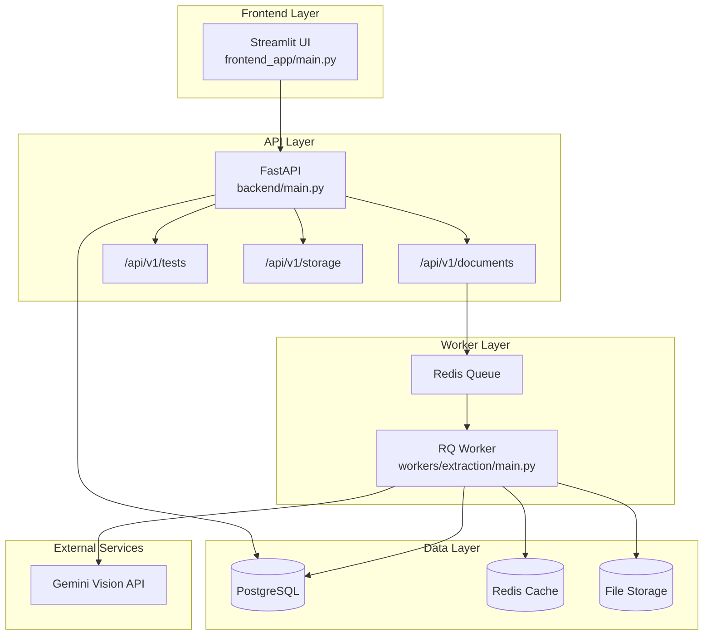

---

## Request Flow Diagrams

### 1. System Startup Flow

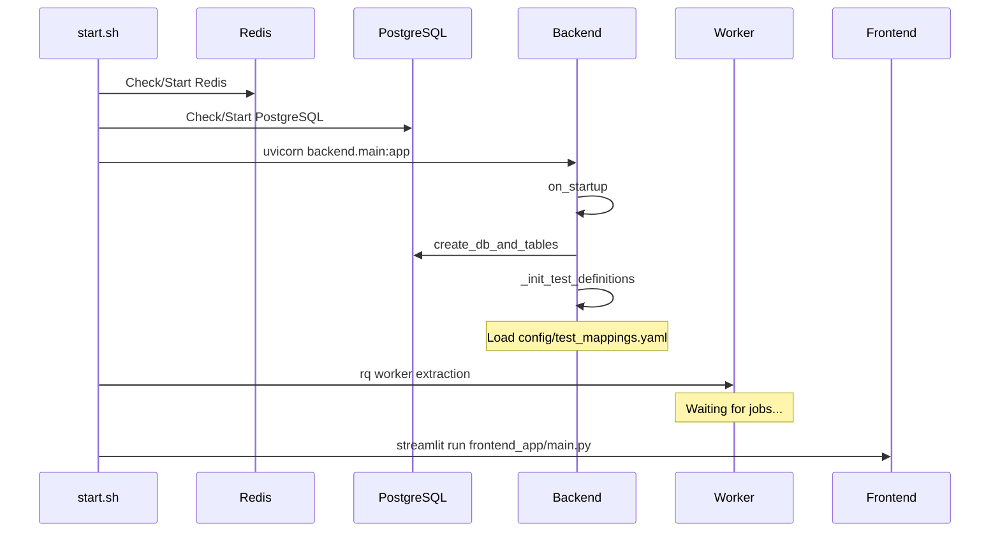

---

### 2. Document Upload and Extraction Pipeline

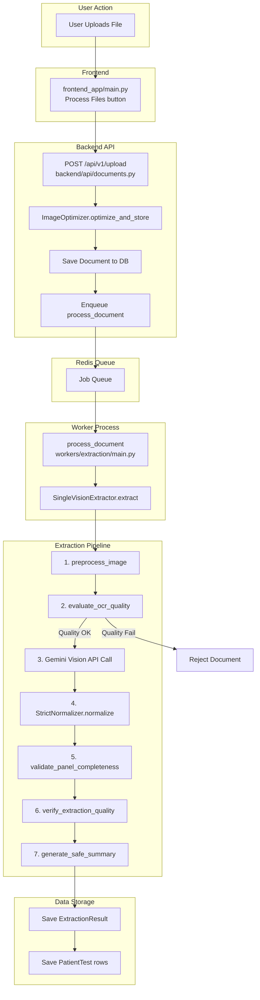

---

### 3. Detailed Extraction Pipeline

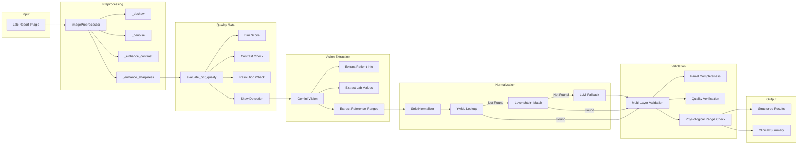

---

### 4. Rate Limiting and Caching Flow

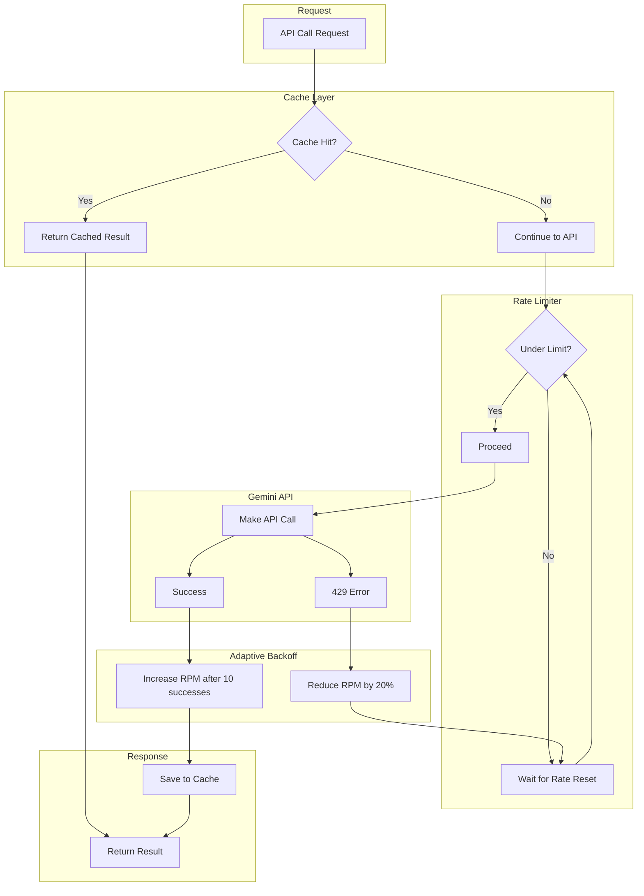

---

### 5. Dashboard and Analytics Flow

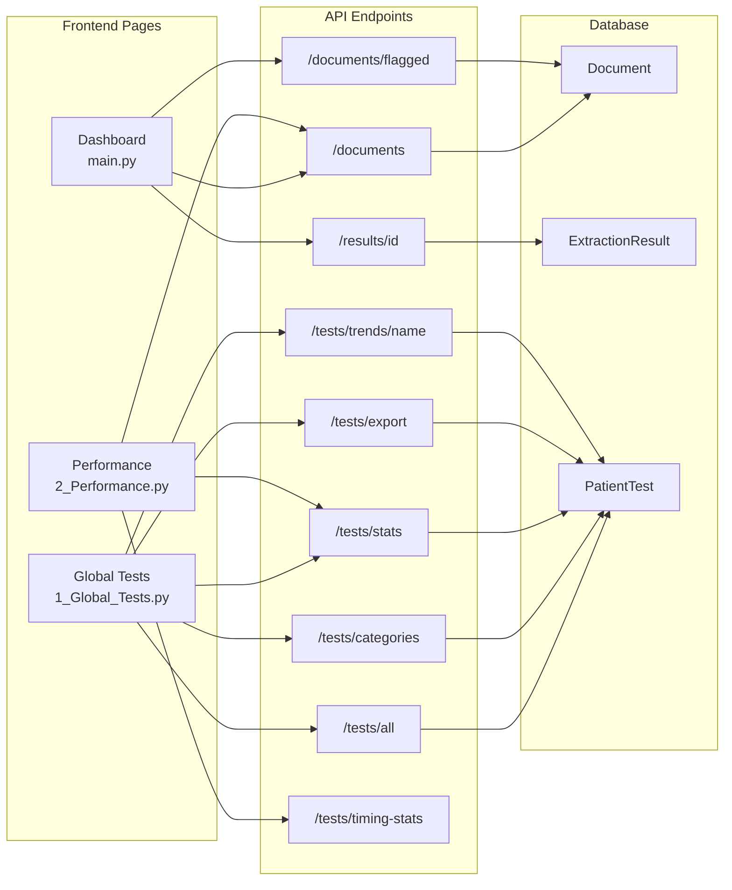

---

## File-by-File Reference

### Core Components

| File | Purpose | Key Functions |
|------|---------|---------------|
| `backend/main.py` | FastAPI application entry | `on_startup()`, router registration |
| `backend/core/config.py` | Configuration management | `get_settings()` |
| `backend/core/database.py` | Database connection | `create_db_and_tables()`, `get_session()` |
| `backend/core/queue.py` | Redis queue setup | `get_queue()` |

---

### API Layer

| File | Endpoints | Description |
|------|-----------|-------------|
| `backend/api/documents.py` | `/upload`, `/documents`, `/results/{id}` | Document upload, status, results |
| `backend/api/tests.py` | `/tests/*` | Analytics, trends, exports |
| `backend/api/storage.py` | `/storage/*` | Storage stats, cleanup, diagnostics |

---

### Worker Layer

| File | Functions | Description |
|------|-----------|-------------|
| `workers/extraction/main.py` | `process_document()` | RQ job handler, saves results |
| `single_vision_extractor.py` | `SingleVisionExtractor.extract()` | Main extraction pipeline |
| `preprocessing.py` | `preprocess_image()`, `ImagePreprocessor` | Image enhancement |
| `ocr_quality.py` | `evaluate_ocr_quality()` | Quality gating |
| `strict_normalizer.py` | `StrictNormalizer.normalize()` | Test name standardization |
| `panel_validator.py` | `validate_panel_completeness()` | Panel completeness checks |
| `quality_verifier.py` | `verify_extraction_quality()` | Result quality verification |
| `safe_summary.py` | `generate_safe_summary()` | Clinical summary generation |
| `rate_limiter.py` | `get_rate_limiter()` | Adaptive API throttling |
| `cache_manager.py` | `CacheManager` | Two-tier caching Redis plus disk |
| `batch_processor.py` | `BatchProcessor` | Bulk document processing |

---

### Data Models

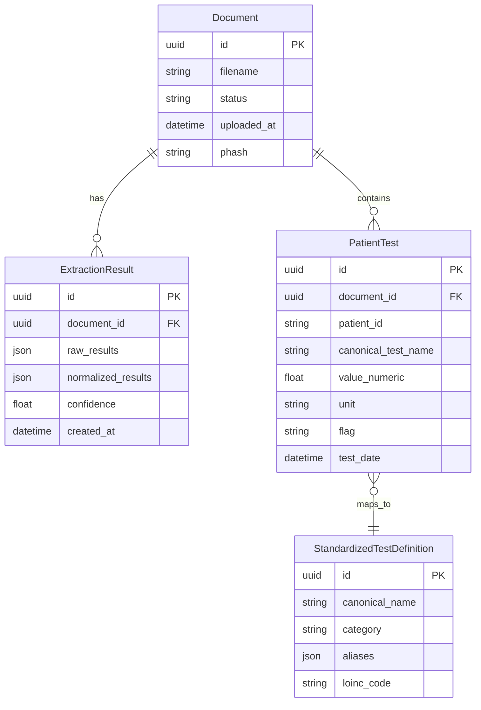

---

### Frontend Pages

| Page | File | API Calls |
|------|------|-----------|
| Home/Upload | `frontend_app/main.py` | `/upload`, `/documents`, `/results/{id}` |
| Global Tests | `pages/1_Global_Tests.py` | `/tests/all`, `/tests/export`, `/tests/trends/*` |
| Performance | `pages/2_Performance.py` | `/documents`, `/tests/stats`, `/tests/timing-stats` |
| Comparison | `pages/3_Approach_Comparison.py` | `/compare-approaches` (not implemented) |

---

### Configuration Files

| File | Purpose |
|------|---------|
| `config/settings.yaml` | Application configuration |
| `config/test_mappings.yaml` | Canonical test definitions and aliases |
| `.env` / `.env.example` | Environment variables |
| `docker-compose.yaml` | Container orchestration |

---

### Test Structure

```
tests/
├── unit/                    # Unit tests
│   ├── test_rate_limiter.py
│   ├── test_cache_manager.py
│   ├── test_preprocessing.py
│   ├── test_ocr_quality.py
│   └── test_normalizer.py
├── integration/             # API integration tests
│   └── test_api_endpoints.py
├── e2e/                     # End-to-end tests
│   └── test_extraction_pipeline.py
├── fixtures/                # Test data
└── conftest.py              # Shared fixtures
```

---

## Quick Reference: Key Function Chains

### Upload to Extraction to Results

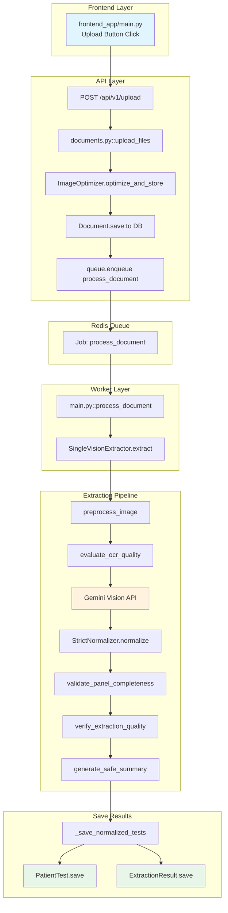

---

### Analytics Query Flow

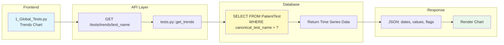

---

### Document Status Check Flow

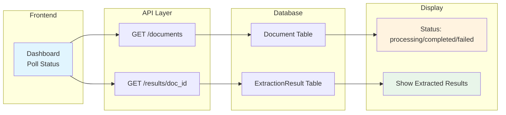

---

### Complete System Interaction

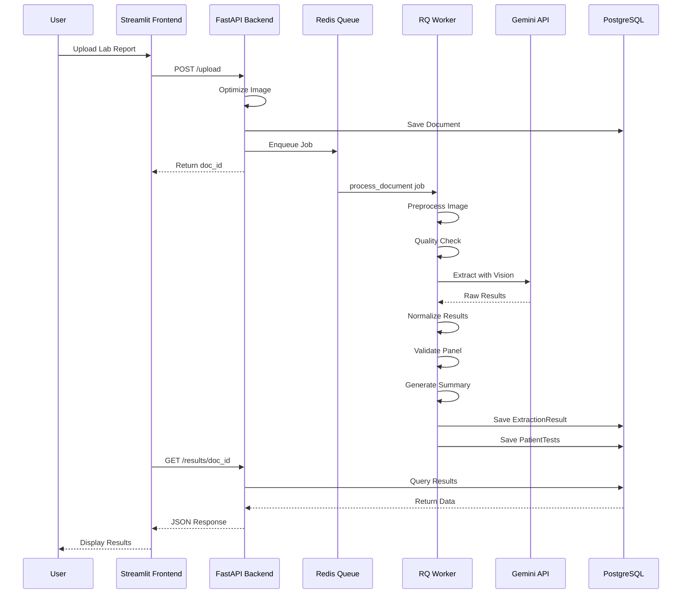
